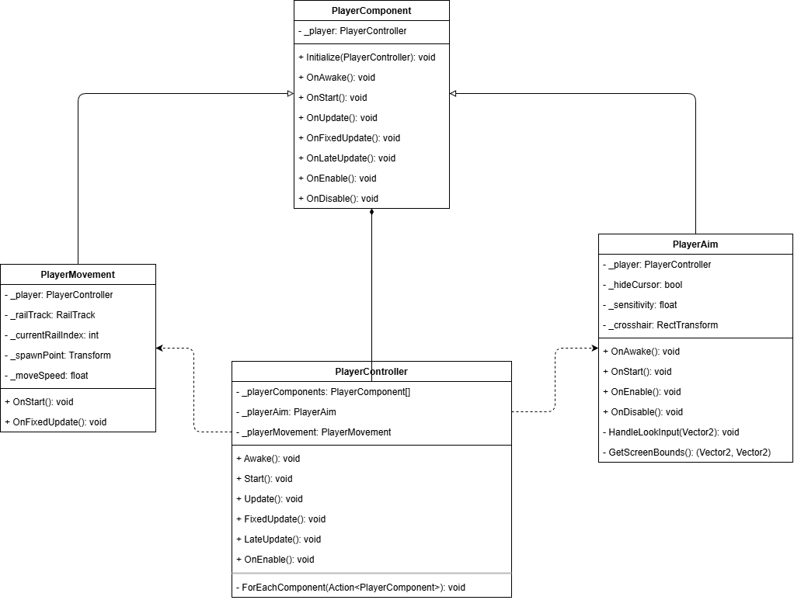

# Sistema de Player

> Este README explica um sistema modular de controle do jogador usando o padrão de componentes.

## Diagrama de Classes

## Classes

### PlayerController
**Arquivo**: `PlayerController.cs`

Classe principal que gerencia todos os componentes do jogador. Herda de `MonoBehaviour` e coordena o ciclo de vida dos componentes.

**Responsabilidades**:
- Inicializar e gerenciar componentes do jogador
- Distribuir eventos do Unity (Awake, Start, Update, etc.) para todos os componentes
- Manter referências serializadas para configuração no Inspector

### PlayerComponent
**Arquivo**: `Components/PlayerComponent.cs`

Classe base abstrata para todos os componentes do jogador.

**Responsabilidades**:
- Fornecer referência ao PlayerController
- Definir métodos virtuais para o ciclo de vida do Unity
- Servir como base para implementações específicas

### PlayerAim
**Arquivo**: `Components/PlayerAim.cs`

Componente responsável pelo sistema de mira do jogador.

**Funcionalidades**:
- Controle do cursor e mira
- Leitura de input de mouse/look
- Movimentação da crosshair na tela
- Gerenciamento de sensibilidade

### PlayerMovement  
**Arquivo**: `Components/PlayerMovement.cs`

Componente responsável pela movimentação do jogador ao longo dos trilhos.

**Funcionalidades**:
- Movimentação automática pelos rails
- Controle de velocidade
- Gerenciamento de pontos de pausa
- Ativação/desativação de câmeras nos railpoints.